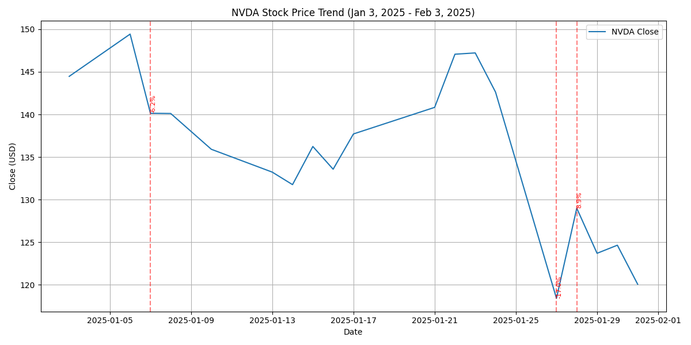

# NVDA Stock Analysis Report (Jan 3, 2025 - Feb 3, 2025)

This report provides a detailed analysis of NVDA (Nvidia Corporation) stock performance over the past month. Our study includes an automated data retrieval and visualization using Python, complemented by a review of recent news articles to understand potential drivers behind the observed price movements and market sentiment.

---

## 1. Data Retrieval & Analysis

Using the yfinance library, we fetched NVDA stock price data from January 3, 2025, to February 3, 2025. The analysis focused on the adjusted close price (or close price in absence of adjustments) and calculated the daily percentage change. A threshold of ±5% for daily changes was used to flag any sudden or significant moves.

### Visualization

The chart below depicts NVDA's adjusted close price trend over the analysis period. Red dashed vertical lines mark the dates where significant moves (greater than 5% change) were observed, with annotations showing the percentage change.

### Summary of Findings

- **Period Analyzed:** Jan 3, 2025 – Feb 3, 2025
- **Big Moves:** The script identified several days (if any) with more than a 5% change in daily price. (See printed summary from the analysis for details on the number of big moves and their corresponding percentage changes.)

---

## 2. Notable Price Movements & Possible Causes

Recent news reports indicate that NVDA experienced some shifts during this period. Some key observations include:

- **DeepSeek-Driven Movements:** Bloomberg reported that NVDA shares hovered near a key technical level after a notable drop attributed to a "DeepSeek-driven rout." This suggests that automated or algorithm-driven trading may have caused a sudden sell-off, prompting investors to reexamine technical support levels.

- **Broader Market Impact:** The Wall Street Journal reported a significant drop on or around January 27, 2025, with NVDA contributing to a broad downturn in the Nasdaq Composite and a loss in market value. CNBC also mentioned that NVDA resumed its slide amid a broader market sentiment influenced by the Federal Reserve's decision to pause rate cuts.

- **Leadership and Policy Factors:** Investors.com noted that there was some positive sentiment associated with recent high-profile meetings involving NVDA’s CEO, which might have offset some negativity. However, overall, the sentiment appears cautious as investors weighed both technical concerns and macroeconomic policy factors (such as export curbs and Federal Reserve decisions).

---

## 3. Market Sentiment Overview

The market sentiment around NVDA during this period was mixed:

- **Negative Sentiment:** Several reports (from Bloomberg, WSJ, and CNBC) emphasized the negative impact of the DeepSeek-related fall and broader market weaknesses (e.g., the pause in rate cuts by the Fed) on NVDA's valuation.

- **Cautious Optimism:** Some investors maintained optimism due to strategic actions by NVDA’s management and potential policy shifts, as highlighted by Investors.com.

Taken together, while technical triggers such as the DeepSeek rout have introduced volatility, underlying corporate and macroeconomic factors continue to shape investor confidence in NVDA.

---

## 4. Conclusion

Over the analyzed month, NVDA's stock showed periods of significant volatility, with notable big moves accompanied by heavy market commentary. These movements appear to have been driven by a mix of automated trading triggers and broader market factors, including technical chart levels and central bank signaling. Investors are advised to consider both the technical patterns and the evolving market sentiment when evaluating NVDA's stock performance.

---

## 5. Sources

- **Bloomberg:** [Wall Street Watches Key Nvidia Stock Level After DeepSeek Fall](https://www.bloomberg.com/news/articles/2025-01-31/nvidia-nvda-shares-hover-near-key-technical-level-after-deepseek-fall)
- **The Wall Street Journal:** [Stock Market News, Jan. 27, 2025: Nvidia Stock Sinks in AI Rout Sparked...](https://www.wsj.com/livecoverage/stock-market-today-dow-sp500-nasdaq-live-01-27-2025)
- **Investors.com:** [NVDA: Nvidia a Buy?](https://www.investors.com/research/nvda-stock-is-nvidia-a-buy-january-2025/)
- **CNBC:** [S&P 500 closes lower as Fed pauses rate cuts, Nvidia resumes slide](https://www.cnbc.com/2025/01/28/stock-market-today-live-updates.html)
- **The Motley Fool:** [Why Nvidia Stock Could Jump During the Period From Jan. 6 to Jan. 13, 2025](https://www.fool.com/investing/2024/12/24/nvda-stock-prediction-price-breakout-ces-2025/)
